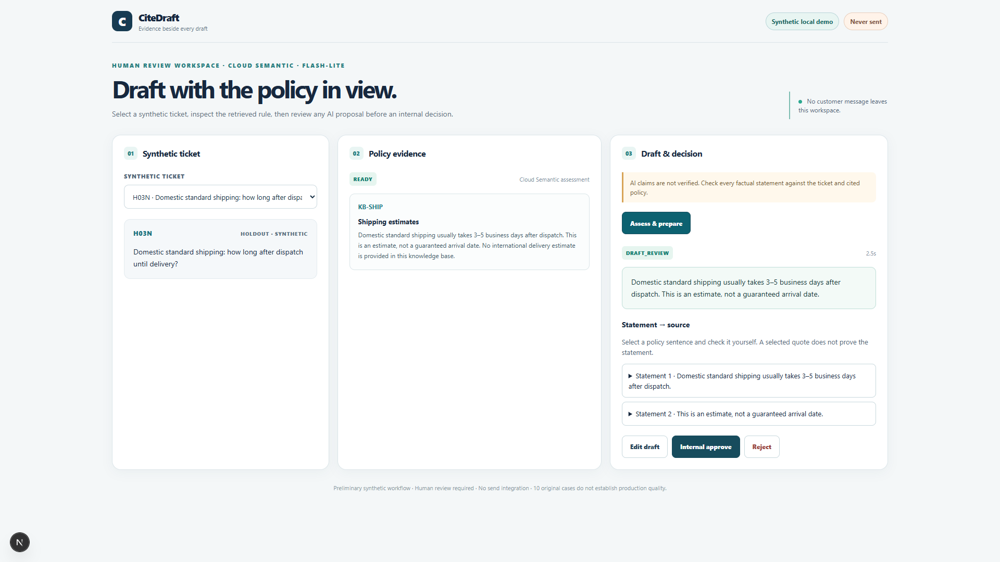
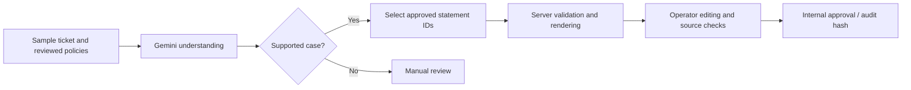

# CiteDraft

A support drafting prototype that keeps the customer's question, company policy and proposed reply in one review workspace.

[Watch the local demo, 74 seconds](https://ilyam-dev-source.github.io/ilyam-dev-source/#citedraft) · [Download MP4](../media/citedraft-demo.mp4) · [Back to profile](../README.md)

## Workflow

1. Gemini interprets the ticket against the reviewed policy context.
2. Supported cases use a second call to select an action and approved statement IDs.
3. The server validates the selection and renders a draft from reviewed wording.
4. The operator can edit the draft, then associate each revised statement with an exact policy sentence and mark it checked.
5. Internal approval records the exact reviewed text and its hash in the audit log. The application never sends a reply to a customer.

## Why these boundaries matter

Structured output makes the model's answer inspectable, but it does not prove that the chosen action fits the ticket. The approved statement catalog restricts generated wording. Edited text requires a new human check; selecting a source or checking a box is not an automatic factuality guarantee.

Audit records link the approved text to the ticket, policy/prompt versions and model versions. They help trace what was reviewed without implying that the application independently proved it correct.

## Recorded example

The October 8 video uses a real Gemini Flash-Lite response to a sample domestic-shipping question. The operator edits the 3–5 business day estimate, checks both the estimate and the no-guarantee qualification against policy sentences, and approves internally. The recording check verified the exact saved text and matching audit hash, with no uncaught browser JavaScript errors.

The two remote stages use Flash-Lite only in this explicit Cloud Semantic mode. The example is one selected workflow, not an accuracy benchmark.

## Evaluation and limitations

The October 5 app-path regression retained all 48 synthetic cases. Among 47 strict cases, route correctness was 46/47 and action correctness 45/47; all 29 displayed drafts were supported under author/agent grading. Known failures and the original call-contract discrepancy are retained in the private evaluation record. This reused, authored dataset is not a fresh independent benchmark, and these numbers do not establish production accuracy.

The prototype has no helpdesk connector, customer-message delivery, public live-model endpoint or real-customer validation. The public portfolio page hosts the recording, not the application. The older static replay contains earlier-version results and is not included in this current-version package.
