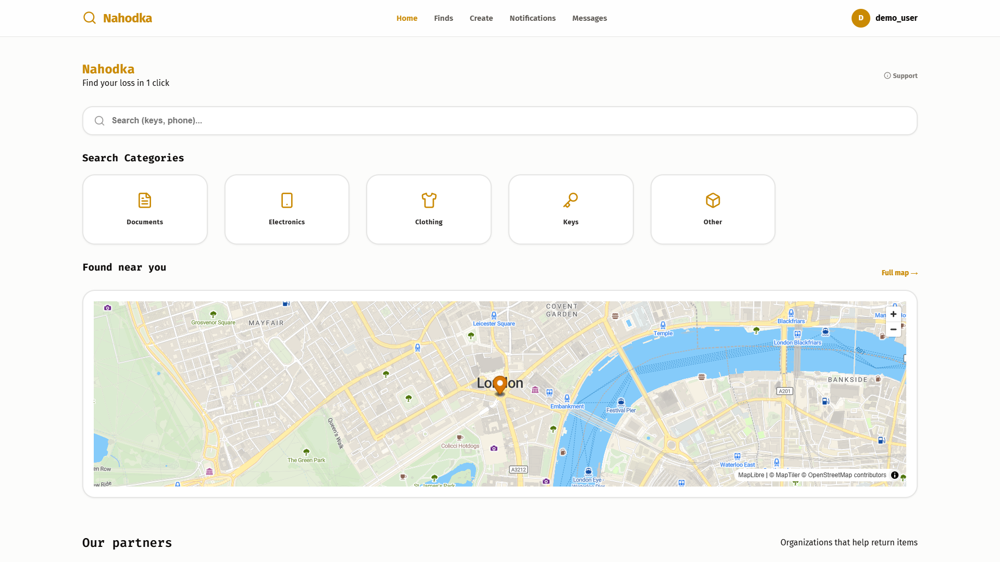
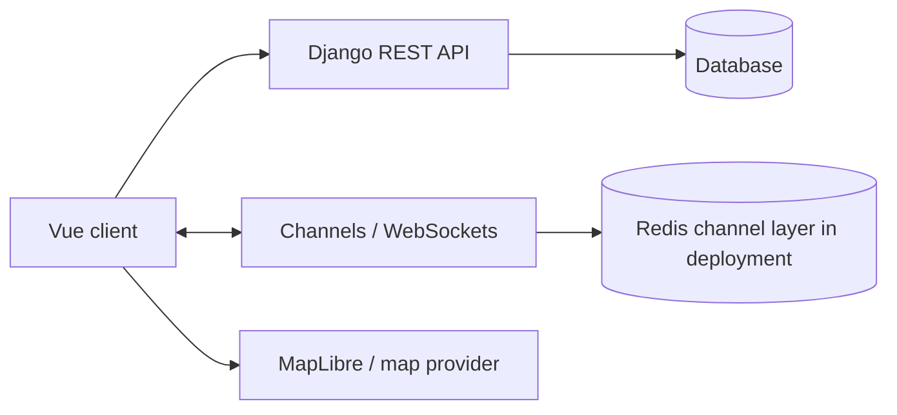

# Nahodka

A lost-and-found service for individuals and partner organizations. Listings combine category, description and location; users can inspect found items and contact the organization holding them.

[Watch the local demo, 89 seconds](../media/nahodka-demo.mp4) · [Back to profile](../README.md)

## What I built

- A Vue client with a Django REST Framework API, structured listings and role-specific workspaces.
- MapLibre maps and configurable global map/geocoding endpoints.
- Persistent messaging, WebSocket delivery, notifications and partner organization profiles.
- Server-side permissions, cookie-based authentication, CSRF checks and upload validation.
- English-first localization with a persistent Russian option; user content is not automatically translated.

## Architecture

The database stores messages and listing state. WebSockets deliver updates, so conversation history does not depend on a client staying connected. Backend permissions restrict private fields and partner operations.

## What the video shows

A loaded London map, gradual creation of a lost-item report, a Tower Bridge map pin, publication, a found-item category filter, inspection of a possible match and a message to the partner organization.

A shared category is a search aid, not proof that two listings describe the same item. The recording uses sample accounts and listings. It runs in the supported local SQLite/in-memory channel configuration, not the PostgreSQL/Redis deployment configuration.

## Engineering evidence

The October 8 recording completed the report and messaging flow without uncaught browser JavaScript errors. The October 5 verification record reports 32 Django tests and 18 frontend tests passing, zero lint warnings, successful builds and no known findings from the recorded dependency, secret and static-analysis checks. Those are dated checks, not a fresh full audit for this page.

## Scope

Bachelor's project with subsequent portfolio preparation. It has no claimed production usage or performance benchmark. Public hosting is not yet available. Production operation would require separate validation of storage, email, map quotas, abuse controls and the deployed WebSocket setup.
