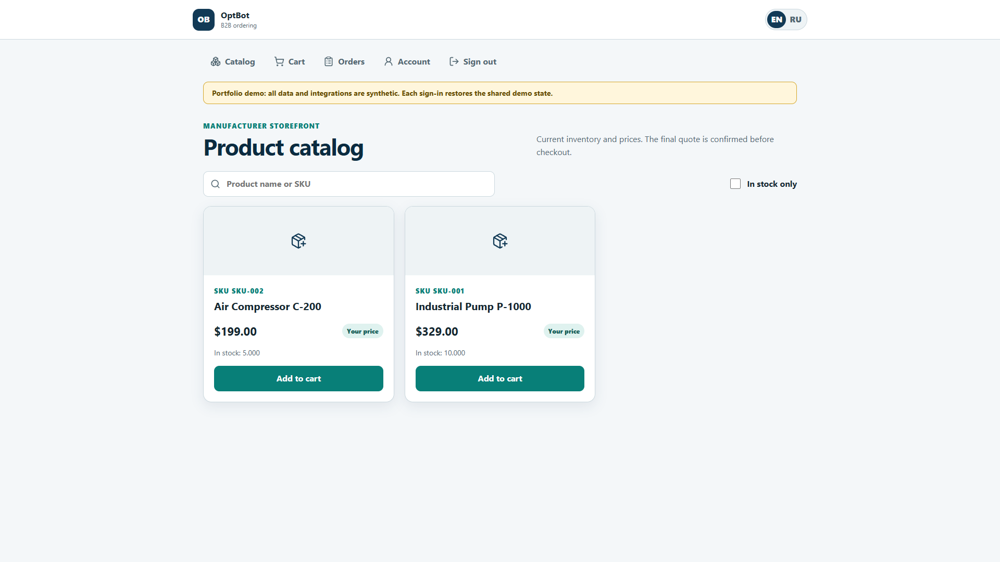
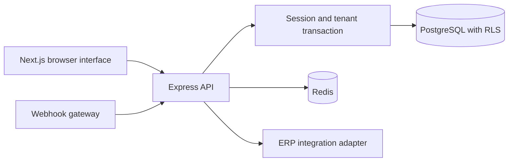

# OptBot

A B2B ordering platform for a manufacturer's dealer network. Visitors can browse retail prices; approved dealers see their contract prices and place orders. Supplier managers have a separate workspace for dealers and payment terms.

[Watch the local demo, 76 seconds](../media/optbot-demo.mp4) · [Back to profile](../README.md)

## What I built

- A TypeScript monorepo with a Next.js/React web client, Express API and a webhook gateway.
- Public catalog and cart, authenticated dealer pricing, server-side quote verification and order workflows.
- Tenant-scoped database access with PostgreSQL FORCE RLS and application authorization.
- Redis-backed caching/rate limits, readiness checks and graceful shutdown.
- ERP integration boundaries, webhook validation, English/Russian localization and PWA support.

## How a request moves through the system

The API establishes identity and tenant context before each tenant-scoped operation. Database policies enforce the tenant boundary independently of application query filters. Transactions keep order transitions and webhook deduplication consistent.

## What the video shows

Public catalog, supplier dashboard, dealer sign-in, the dealer's negotiated price, cart review, price verification, order creation and a simulated ERP confirmation.

The catalog, sessions, PostgreSQL RLS and order state transitions run in the local application. External company lookup, email, KMS wrapping and ERP calls use deterministic demo adapters. The recording does not demonstrate a live ERP connection. Each demo sign-in resets the shared synthetic state and can invalidate the previous demo session.

## Engineering evidence

The recorded order flow completed on the local Docker stack on October 8, 2026, with no uncaught browser JavaScript errors. The October 5 verification record reports 193 passing tests, one skipped external ERP sandbox test and a successful production build. The recorded coverage was 75.61% statements and 82.00% lines. These figures are a dated baseline, not a new test run performed for this page.

That record also reports no production dependency vulnerabilities or secret/SAST findings. Four High findings remained in development-only ESLint dependencies. Live ERP verification requires sandbox credentials; the local demo does not satisfy that external gate.

## Scope

Self-directed prototype, with no claimed customers, revenue or production-load results. Public hosting is not yet available. The local video demonstrates the workflow without exposing customer data.
